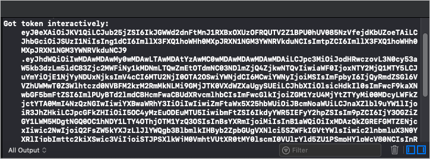

<!-- markdownlint-disable MD002 MD041 -->

In dieser Übung erweitern Sie die Anwendung aus der vorherigen Übung, um die Authentifizierung mit Azure AD zu unterstützen. Dies ist erforderlich, um das erforderliche OAuth-Zugriffstoken zum Aufrufen von Microsoft Graph zu erhalten. Hierzu integrieren Sie die [Microsoft-Authentifizierungsbibliothek (MSAL) für IOS](https://github.com/AzureAD/microsoft-authentication-library-for-objc) in die Anwendung.

1. Erstellen Sie eine neue **Eigenschaftenlisten** Datei im **GraphTutorial** -Projekt mit dem Namen **AuthSettings. plist**.
1. Fügen Sie die folgenden Elemente zur Datei im **Stamm** Wörterbuch hinzu.

    | Key | Typ | Wert |
    |-----|------|-------|
    | `AppId` | Zeichenfolge | Die Anwendungs-ID aus dem Azure-Portal |
    | `GraphScopes` | Array | Zwei Zeichenfolgenwerte `User.Read` : und`Calendars.Read` |

    

> [!IMPORTANT]
> Wenn Sie die Quellcodeverwaltung wie git verwenden, wäre es nun ein guter Zeitpunkt, die Datei **AuthSettings. plist** aus der Quellcodeverwaltung auszuschließen, um unbeabsichtigtes Auslaufen ihrer APP-ID zu vermeiden.

## <a name="implement-sign-in"></a>Implementieren der Anmeldung

In diesem Abschnitt Konfigurieren Sie das Projekt für MSAL, erstellen eine Authentifizierungs-Manager-Klasse und aktualisieren die APP, um sich anzumelden und abzumelden.

### <a name="configure-project-for-msal"></a>Konfigurieren des Projekts für MSAL

1. Fügen Sie der Projektfunktion eine neue Schlüsselbund Gruppe hinzu.
    1. Wählen Sie das **GraphTutorial** -Projekt aus, und **Signieren Sie & Funktionen**.
    1. Wählen Sie **+-Funktion**aus, und doppelklicken Sie dann auf **Schlüsselbund Freigabe**.
    1. Fügen Sie eine Schlüsselbund Gruppe mit `com.microsoft.adalcache`dem Wert hinzu.

1. Steuerelement klicken Sie auf **Info. plist** , und wählen Sie dann **Öffnen als**, dann **Quellcode**aus.
1. Fügen Sie das folgende innerhalb `<dict>` des-Elements hinzu.

    ```xml
    <key>CFBundleURLTypes</key>
    <array>
      <dict>
        <key>CFBundleURLSchemes</key>
        <array>
          <string>msauth.$(PRODUCT_BUNDLE_IDENTIFIER)</string>
        </array>
      </dict>
    </array>
    <key>LSApplicationQueriesSchemes</key>
    <array>
        <string>msauthv2</string>
        <string>msauthv3</string>
    </array>
    ```

1. Öffnen Sie **AppDelegate. m** , und fügen Sie die folgende Importanweisung am Anfang der Datei hinzu.

    ```objc
    #import <MSAL/MSAL.h>
    ```

1. Fügen Sie die folgende Funktion zur `AppDelegate`-Klasse hinzu:

    :::code language="objc" source="../demo/GraphTutorial/GraphTutorial/AppDelegate.m" id="HandleMsalResponseSnippet":::

### <a name="create-authentication-manager"></a>Erstellen des Authentifizierungs-Managers

1. Erstellen Sie eine neue **Cocoa Touch-Klasse** im **GraphTutorial** -Projekt mit dem Namen **AuthenticationManager**. Wählen Sie **NSObject** in der unter **Klasse von Field aus** .
1. Öffnen Sie **AuthenticationManager. h** , und ersetzen Sie den Inhalt durch den folgenden Code.

    :::code language="objc" source="../demo/GraphTutorial/GraphTutorial/AuthenticationManager.h" id="AuthManagerSnippet":::

1. Öffnen Sie **AuthenticationManager. m** , und ersetzen Sie den Inhalt durch den folgenden Code.

    :::code language="objc" source="../demo/GraphTutorial/GraphTutorial/AuthenticationManager.m" id="AuthManagerSnippet":::

### <a name="add-sign-in-and-sign-out"></a>Hinzufügen von Anmelde-und Abmeldungen

1. Öffnen Sie die Datei **SignInViewController. m** , und ersetzen Sie den Inhalt durch den folgenden Code.

    :::code language="objc" source="../demo/GraphTutorial/GraphTutorial/SignInViewController.m" id="SignInViewSnippet":::

1. Öffnen Sie **WelcomeViewController. m** , und fügen `import` Sie die folgende Anweisung am Anfang der Datei hinzu.

    ```objc
    #import "AuthenticationManager.h"
    ```

1. Ersetzen Sie die vorhandene `signOut`-Funktion durch Folgendes.

    :::code language="objc" source="../demo/GraphTutorial/GraphTutorial/WelcomeViewController.m" id="SignOutSnippet":::

1. Speichern Sie Ihre Änderungen, und starten Sie die Anwendung im Simulator neu.

Wenn Sie sich bei der App anmelden, sollten Sie ein Zugriffstoken sehen, das im Ausgabefenster von Xcode angezeigt wird.



## <a name="get-user-details"></a>Benutzerdetails abrufen

In diesem Abschnitt erstellen Sie eine Hilfsklasse, die alle Aufrufe von Microsoft Graph enthält, und aktualisieren Sie `WelcomeViewController` , um die neue Klasse zum Abrufen des angemeldeten Benutzers zu verwenden.

1. Erstellen Sie eine neue **Cocoa Touch-Klasse** im **GraphTutorial** -Projekt mit dem Namen **graphmanager**. Wählen Sie **NSObject** in der unter **Klasse von Field aus** .
1. Öffnen Sie **graphmanager. h** , und ersetzen Sie den Inhalt durch den folgenden Code.

    ```objc
    #import <Foundation/Foundation.h>
    #import <MSGraphClientSDK/MSGraphClientSDK.h>
    #import <MSGraphClientModels/MSGraphClientModels.h>
    #import <MSGraphClientModels/MSCollection.h>
    #import "AuthenticationManager.h"

    NS_ASSUME_NONNULL_BEGIN

    typedef void (^GetMeCompletionBlock)(MSGraphUser* _Nullable user, NSError* _Nullable error);

    @interface GraphManager : NSObject

    + (id) instance;
    - (void) getMeWithCompletionBlock: (GetMeCompletionBlock)completionBlock;

    @end

    NS_ASSUME_NONNULL_END
    ```

1. Öffnen Sie **graphmanager. m** , und ersetzen Sie den Inhalt durch den folgenden Code.

    ```objc
    #import "GraphManager.h"

    @interface GraphManager()

    @property MSHTTPClient* graphClient;

    @end

    @implementation GraphManager

    + (id) instance {
        static GraphManager *singleInstance = nil;
        static dispatch_once_t onceToken;
        dispatch_once(&onceToken, ^ {
            singleInstance = [[self alloc] init];
        });

        return singleInstance;
    }

    - (id) init {
        if (self = [super init]) {
            // Create the Graph client
            self.graphClient = [MSClientFactory
                                createHTTPClientWithAuthenticationProvider:AuthenticationManager.instance];
        }

        return self;
    }

    - (void) getMeWithCompletionBlock:(GetMeCompletionBlock)completionBlock {
        // GET /me
        NSString* meUrlString = [NSString stringWithFormat:@"%@/me", MSGraphBaseURL];
        NSURL* meUrl = [[NSURL alloc] initWithString:meUrlString];
        NSMutableURLRequest* meRequest = [[NSMutableURLRequest alloc] initWithURL:meUrl];

        MSURLSessionDataTask* meDataTask =
        [[MSURLSessionDataTask alloc]
            initWithRequest:meRequest
            client:self.graphClient
            completion:^(NSData *data, NSURLResponse *response, NSError *error) {
                if (error) {
                    completionBlock(nil, error);
                    return;
                }

                // Deserialize the response as a user
                NSError* graphError;
                MSGraphUser* user = [[MSGraphUser alloc] initWithData:data error:&graphError];

                if (graphError) {
                    completionBlock(nil, graphError);
                } else {
                    completionBlock(user, nil);
                }
            }];

        // Execute the request
        [meDataTask execute];
    }

    @end
    ```

1. Öffnen Sie **WelcomeViewController. m** , und fügen `#import` Sie die folgenden Anweisungen am Anfang der Datei hinzu.

    ```objc
    #import "SpinnerViewController.h"
    #import "GraphManager.h"
    #import <MSGraphClientModels/MSGraphClientModels.h>
    ```

1. Fügen Sie die folgende Eigenschaft zur `WelcomeViewController` Schnittstellendeklaration hinzu.

    ```objc
    @property SpinnerViewController* spinner;
    ```

1. Ersetzen Sie den `viewDidLoad` vorhandenen durch den folgenden Code.

    :::code language="objc" source="../demo/GraphTutorial/GraphTutorial/WelcomeViewController.m" id="ViewDidLoadSnippet":::

Wenn Sie Ihre Änderungen speichern und die APP jetzt neu starten, wird die Benutzeroberfläche nach der Anmeldung mit dem Anzeigenamen und der e-Mail-Adresse des Benutzers aktualisiert.
